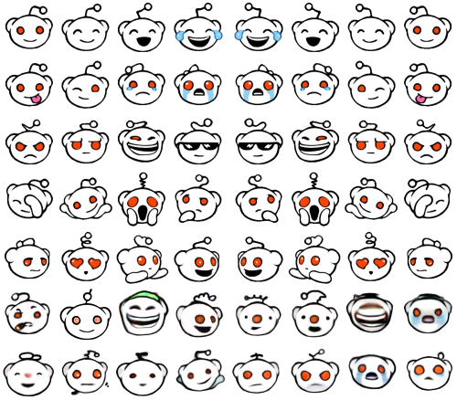
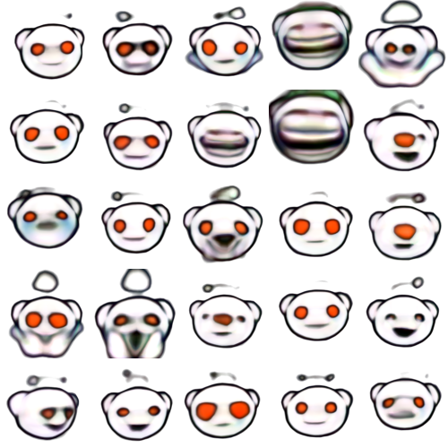

# Reddit Logo Generator
This repository contains code of my subbmition to [r/proceduralgeneration/](https://www.reddit.com/r/proceduralgeneration/) challenge of creating procedurally generated reddit logos

I views it as a great opportunity to demonstrate ability of [ConGAN](https://github.com/Mylittlerapture/ConGAN) generate ready-to-use results even with extremely small amount of examples. Whole system was trained on this dataset:  

It was slightly augmented by training on smaller dataset, cherry-picking some good results, slightly improving and than adding them up (last two rows).
And here are kind of results what I've got:  

After that I created a small script called [run.py](run.py) that combine this avatars with random background and text style to produce final result, that look like this:  
  

### Dependencies
Keras 2.2.0  
PIL 5.0.0  
Numpy 1.14.2  

### Run
Execute run.py

All generated images will be saved into "samples" folder one by one, if **BIG_IMAGE** parameter set **True** they will also be saved as one big image called "big_img.png"
